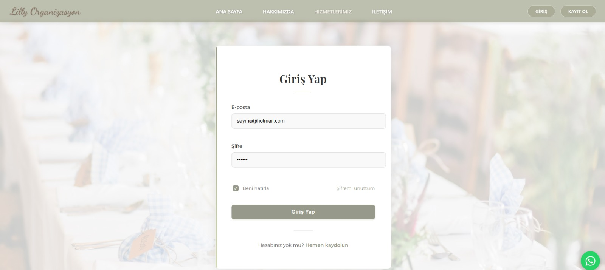
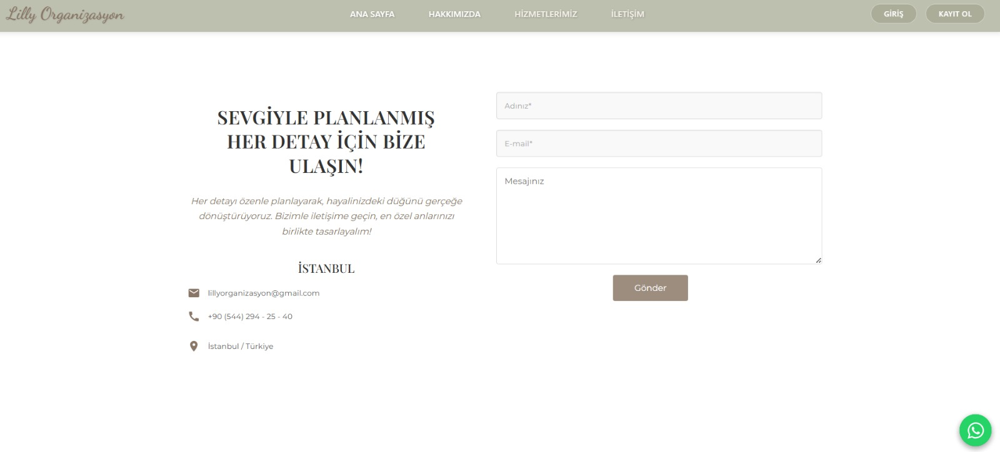

# 🎉 OrganizationWebSite - Organizasyon Rezervasyon Sistemi

Bu proje, düğün, doğum günü, nişan, kına ve benzeri birçok etkinlik için **online rezervasyon** işlemlerinin yapılabildiği tam kapsamlı bir **organizasyon rezervasyon sistemidir**. Kullanıcılar kayıt olabilir, giriş yapabilir ve tercih ettikleri organizasyonlar için rezervasyon oluşturabilir. Admin ve kullanıcı tarafında farklı rollerle sistem yönetilebilir.

---

## 📸 Örnek Ekran Görüntüleri

### 🏠 Ana Sayfa

### 🔐 Giriş Sayfası

### 📝 Kayıt Sayfası

### 🧾 Kartlar Görünümü

### 📅 Rezervasyon Sayfası

### 🔗 Bağlantı Sayfası

---

## 🛠️ Kullanılan Teknolojiler

### ✅ Frontend (React)
- React.js
- React Router DOM
- Axios (API çağrıları için)
- JWT ile authentication (varsa)

### ✅ Backend (.NET Core Web API)
- ASP.NET Core Web API
- Entity Framework Core
- N Katmanlı Mimari:
  - **Core**: Arayüzler ve servis tanımlamaları
  - **Entity**: Veritabanı varlıkları
  - **DataAccess**: EF Core repository'ler
  - **Business**: İş mantığı ve servis implementasyonları
  - **WebAPI**: API endpoint’leri

### ✅ Veritabanı
- PostgreSQL

---

## 📂 Proje Yapısı

